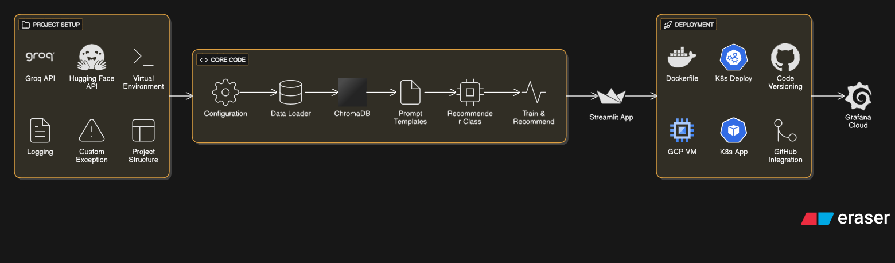

# Anime Recommender AI



## Overview
Anime Recommender AI is a modern, LLM-powered web application that provides personalized anime recommendations based on user preferences. Leveraging advanced language models and vector search, it delivers high-quality, context-aware suggestions for anime fans.

## Features
- **Natural Language Query:** Enter your anime tastes or reference titles in plain English.
- **LLM-Powered Recommendations:** Uses a large language model (via Groq API) and retrieval-augmented generation (RAG) for accurate, engaging suggestions.
- **Rich Data Source:** Draws from a curated dataset of anime titles, genres, and synopses.
- **Modern UI:** Built with Streamlit for an interactive, user-friendly experience.

## How It Works
1. **Data Preparation:**
   - Raw anime data (`anime_with_synopsis.csv`) is processed to combine title, synopsis, and genres into a single field (`anime_updated.csv`).
2. **Vector Store Creation:**
   - The processed data is embedded using HuggingFace models and stored in a Chroma vector database.
3. **Retrieval-Augmented Generation:**
   - User queries retrieve relevant anime entries from the vector store.
   - The LLM (via Groq) is prompted with both the user query and the retrieved context to generate a structured recommendation list.
4. **Recommendation Output:**
   - The app returns three anime recommendations, each with a title, summary, and explanation of the match.

## Project Structure
```
app/           # Streamlit app entry point
pipeline/      # Data processing and pipeline orchestration
src/           # Core logic: data loading, vector store, prompt, recommender
config/        # API keys and model config
utils/         # Logging and custom exceptions
data/          # Raw and processed anime datasets
chroma_db/     # Persisted vector database
logs/          # Log files
```

## Dependencies
- `langchain`, `langchain-community`, `langchain_groq`, `chromadb`, `streamlit`, `pandas`, `python-dotenv`, `sentence-transformers`, `langchain_huggingface`
- See `requirements.txt` for the full list.

## Setup & Usage
### Local Development
1. **Install dependencies:**
   ```bash
   pip install -r requirements.txt
   ```
2. **Set up environment variables:**
   - Create a `.env` file with your `GROQ_API_KEY` and any other required keys.
3. **Build the pipeline:**
   ```bash
   python pipeline/build_pipeline.py
   ```
4. **Run the app:**
   ```bash
   streamlit run app/app.py
   ```

### Production/Cloud Deployment
- See `Deployment_DOCUMENTATION.md` and `llmops-k8s.yaml` for Docker and Kubernetes deployment instructions.
- Supports deployment on Google Cloud VM with Minikube and Kubernetes, including secrets management and monitoring with Grafana.

## Workflow Diagram
The included image `AI+Anime+Recommender+Workflow.png` illustrates the end-to-end workflow:
- **Data Ingestion → Data Processing → Vector Store Creation → User Query → Context Retrieval → LLM Recommendation → Output to User**

## Customization
- **Prompt Engineering:**
  - The prompt template in `src/prompt_template.py` ensures recommendations are well-structured, honest, and user-focused.
- **Model Selection:**
  - Easily switch LLMs by changing the `MODEL_NAME` in `config/config.py`.


## Author
**[Prashanth]**

(Replace this section with your full details as desired.) 