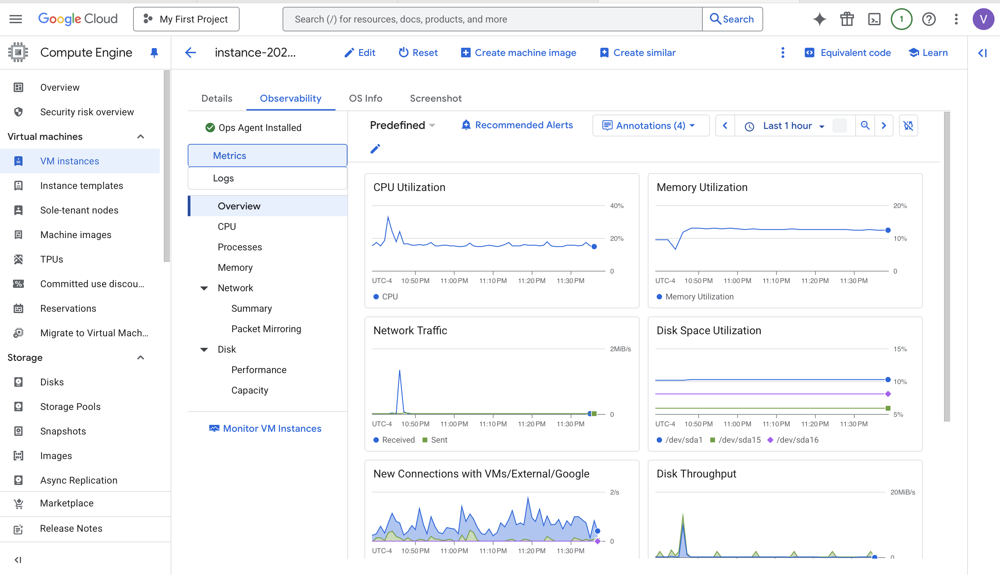

# <center> Anime Recommender AI

 


## Overview
Anime Recommender AI is a modern, LLM-powered web application that provides personalized anime recommendations based on user preferences. Leveraging advanced language models and vector search, it delivers high-quality, context-aware suggestions for anime fans.

## Features
- **Natural Language Query:** Enter your anime tastes or reference titles in plain English.
- **LLM-Powered Recommendations:** Uses a large language model (via Groq API) and retrieval-augmented generation (RAG) for accurate, engaging suggestions.
- **Rich Data Source:** Draws from a curated dataset of anime titles, genres, and synopses.
- **Modern UI:** Built with Streamlit for an interactive, user-friendly experience.

## How It Works
1. **Data Preparation:**
   - Raw anime data (`anime_with_synopsis.csv`) is processed to combine title, synopsis, and genres into a single field (`anime_updated.csv`).
2. **Vector Store Creation:**
   - The processed data is embedded using HuggingFace models and stored in a Chroma vector database.
3. **Retrieval-Augmented Generation:**
   - User queries retrieve relevant anime entries from the vector store.
   - The LLM (via Groq) is prompted with both the user query and the retrieved context to generate a structured recommendation list.
4. **Recommendation Output:**
   - The app returns three anime recommendations, each with a title, summary, and explanation of the match.

## Project Structure
```
app/           # Streamlit app entry point
pipeline/      # Data processing and pipeline orchestration
src/           # Core logic: data loading, vector store, prompt, recommender
config/        # API keys and model config
utils/         # Logging and custom exceptions
data/          # Raw and processed anime datasets
chroma_db/     # Persisted vector database
logs/          # Log files
```

## Dependencies
- `langchain`, `langchain-community`, `langchain_groq`, `chromadb`, `streamlit`, `pandas`, `python-dotenv`, `sentence-transformers`, `langchain_huggingface`
- See `requirements.txt` for the full list.

## Setup & Usage
### Local Development
1. **Install dependencies:**
   ```bash
   pip install -r requirements.txt
   ```
2. **Set up environment variables:**
   - Create a `.env` file with your 
   GROQ_API_KEY="GROQ_API_KEY"
   HUGGINGFACEHUB_API_TOKEN="HUGGINGFACE_API_KEY"

3. **Build the pipeline:**
   ```bash
   python pipeline/build_pipeline.py
   ```
4. **Run the app:**
   ```bash
   streamlit run app/app.py
   ```

# Production/Cloud Deployment
- Check `Deployment_DOCUMENTATION.md` and `llmops-k8s.yaml` for Docker and Kubernetes deployment instructions.
- Supports deployment on Google Cloud VM with Minikube and Kubernetes, including secrets management and monitoring with Grafana.


## **Google Cloud Platform Deployment:**
<br>

**Anime Recommender AI Application deployed into the cloud with Interlinking of Git Platform**


**VM Instance created and established with OS dependencies and security protocols inside the GCP**


 **Observability Dashboard for the deployed VM Instance**



## **Grafana Cloud Monitoring:**


## Workflow Diagram
 **Illustrates the end-to-end workflow**
  

**Data Ingestion → Data Processing → Vector Store Creation → User Query → Context Retrieval → LLM Recommendation → Output to User**

## Customization
- **Prompt Engineering:**
  - The prompt template in `src/prompt_template.py` ensures recommendations are well-structured, honest, and user-focused.
- **Model Selection:**
  - Easily switch LLMs by changing the `MODEL_NAME` in `config/config.py`.


---
<br>


# Project Maintenance Documentation - 2-Week Learning Journey


## Problems Faced During 2-Week Maintenance Period

### Week 1: Initial Setup and Dependency Issues

#### Problem 1: Module Import Errors
**Issue**: When trying to run `streamlit run app/app.py`, the application failed with `ModuleNotFoundError: No module named 'pipeline'`

**Root Cause**: Streamlit doesn't automatically add the project root to Python path, so when running from the `app` directory, Python couldn't find the `pipeline` module.

**Solution**: Added the project root to Python path in `app/app.py`:
```python
import sys
import os

# Add the project root to Python path
project_root = os.path.dirname(os.path.dirname(os.path.abspath(__file__)))
sys.path.append(project_root)
```

**Learning**: Always ensure proper Python path configuration when working with modular applications, especially when using frameworks like Streamlit that run from specific directories.

#### Problem 2: LangChain Deprecation Warnings
**Issue**: Multiple deprecation warnings appeared:
- `Chroma` class from `langchain_community.vectorstores` was deprecated
- `Chain.__call__` method was deprecated in favor of `invoke()`

**Root Cause**: LangChain had updated their API and moved some classes to separate packages for better modularity.

**Solution**: 
1. Updated imports in `src/vector_store.py`:
   ```python
   from langchain_chroma import Chroma  # Updated from langchain_community.vectorstores
   ```

2. Updated method calls in `src/recommender.py`:
   ```python
   result = self.qa_chain.invoke({"query": query})  # Updated from __call__
   ```

3. Installed the new dependency:
   ```bash
   pip install langchain-chroma
   ```

**Learning**: Always keep dependencies updated and pay attention to deprecation warnings. They indicate future breaking changes.

#### Problem 3: Environment File Parsing Warnings
**Issue**: Python-dotenv showed warnings: "Python-dotenv could not parse statement starting at line 3"

**Root Cause**: The `.env` file had formatting issues or empty lines that confused the parser.

**Impact**: Low - API keys were still loaded correctly, but warnings cluttered the logs.

**Solution**: Cleaned up the `.env` file format and ensured proper key-value pairs without extra whitespace.

**Learning**: Environment files should be properly formatted to avoid parsing issues.

### Week 2: Performance and Stability Improvements

#### Problem 4: Tokenizers Parallelism Warning
**Issue**: HuggingFace tokenizers warning: "The current process just got forked, after parallelism has already been used. Disabling parallelism to avoid deadlocks..."

**Root Cause**: The tokenizers library was trying to use parallelism after the process had been forked, which can cause deadlocks.

**Solution**: Added environment variable in `app/app.py`:
```python
# Set tokenizers parallelism to avoid warnings
os.environ["TOKENIZERS_PARALLELISM"] = "false"
```

**Learning**: Some libraries have specific environment requirements that need to be configured for optimal performance.

#### Problem 5: Dependency Version Conflicts
**Issue**: After installing `langchain-chroma`, there were dependency conflicts with `langsmith` versions.

**Root Cause**: Different LangChain packages required different versions of `langsmith`.

**Solution**: Updated all LangChain packages to compatible versions:
```bash
pip install --upgrade langchain langchain-community
```

**Learning**: Package version management is crucial. Always check for compatibility when adding new dependencies.

#### Problem 6: Requirements.txt Maintenance
**Issue**: The `requirements.txt` file was missing the newly added `langchain-chroma` dependency.

**Solution**: Updated `requirements.txt` to include all necessary dependencies:
```
langchain
langchain-community
langchain_groq
langchain-chroma
chromadb
streamlit
pandas
python-dotenv
sentence-transformers
langchain_huggingface
```

**Learning**: Always keep requirements files updated to ensure reproducible builds.

## Technical Architecture

### Core Components
1. **Vector Store**: Uses ChromaDB with HuggingFace embeddings for similarity search
2. **LLM Integration**: Groq API for generating recommendations
3. **Web Interface**: Streamlit for user interaction
4. **Data Pipeline**: CSV processing and vector embedding generation

### File Structure
```
ANIME RECOMMENDER AI/
├── app/
│   └── app.py                 # Streamlit web interface
├── pipeline/
│   ├── pipeline.py            # Main recommendation pipeline
│   └── build_pipeline.py      # Data processing pipeline
├── src/
│   ├── data_loader.py         # CSV data loading
│   ├── vector_store.py        # ChromaDB integration
│   ├── recommender.py         # LLM recommendation logic
│   └── prompt_template.py     # Prompt engineering
├── config/
│   └── config.py              # Configuration management
├── utils/
│   ├── logger.py              # Logging utilities
│   └── custom_exception.py    # Custom exception handling
├── data/
│   ├── anime_updated.csv      # Anime dataset
│   └── anime_with_synopsis.csv # Anime with descriptions
└── chroma_db/                 # Vector database storage
```

## Key Learnings from This Maintenance Period

### 1. Dependency Management
- Always monitor deprecation warnings
- Keep packages updated regularly
- Use virtual environments for isolation
- Maintain accurate requirements files

### 2. Python Path Issues
- Modular applications need proper path configuration
- Different frameworks may require different path setups
- Always test imports from the intended execution context

### 3. Environment Configuration
- Proper `.env` file formatting is important
- Some libraries require specific environment variables
- Test environment loading in different contexts

### 4. Error Handling and Logging
- Implement proper logging for debugging
- Use custom exceptions for better error handling
- Monitor application logs regularly

### 5. Testing Strategy
- Create test scripts for critical functionality
- Test both individual components and integration
- Verify fixes work in the actual runtime environment

## Running the Application

### Prerequisites
- Python 3.12+
- Groq API key
- HuggingFace API token

### Installation
```bash
# Clone the repository
git clone <repository-url>
cd ANIME_RECOMMENDER_AI

# Install dependencies
pip install -r requirements.txt

# Set up environment variables
cp .env.example .env
# Edit .env with your API keys
```

### Running the App
```bash
streamlit run app/app.py
```

The application will be available at `http://localhost:8501`

## Future Improvements

1. **Add comprehensive testing suite**
2. **Implement caching for better performance**
3. **Add user feedback mechanism**
4. **Expand anime database**
5. **Implement recommendation history**
6. **Add more sophisticated recommendation algorithms**

## Conclusion

This 2-week maintenance period taught me the importance of:
- Proactive dependency management
- Proper project structure and path configuration
- Environment setup and configuration
- Regular testing and validation
- Documentation and knowledge sharing


---


